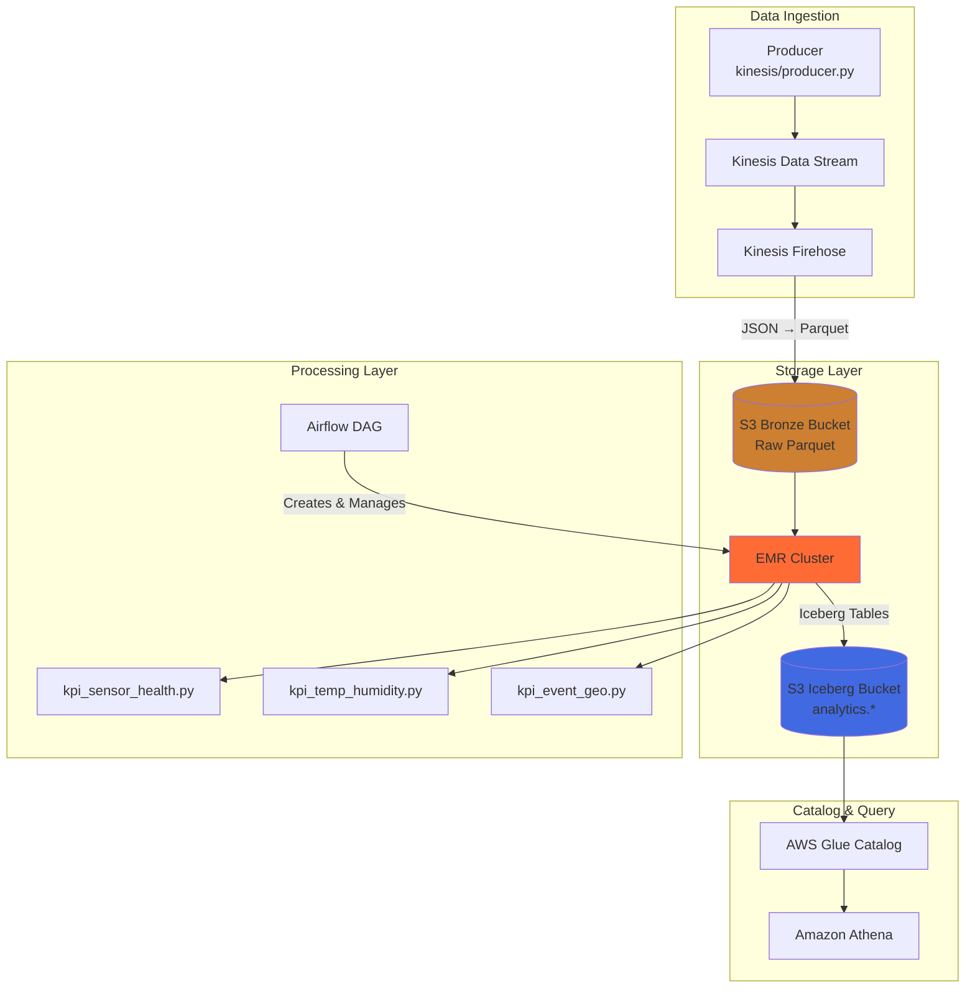
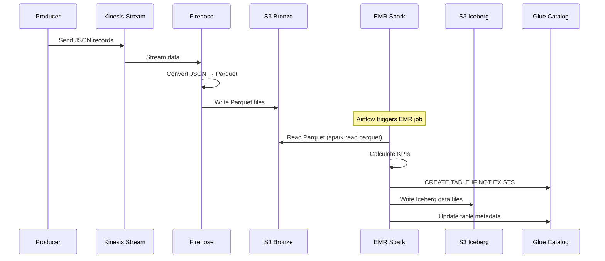

# Clickstream ETL Pipeline

A production-grade real-time data pipeline that ingests IoT sensor data via Kinesis, transforms it using Spark on EMR, and stores results in Apache Iceberg tables for analytics.

---

## Architecture Overview



---

## Data Flow



---

## Project Structure

```
airflow_emr/
├── airflow/                    # Airflow DAGs and helpers
│   ├── clickstream_emr_kpis_dag.py  # Main orchestration DAG
│   └── emr_boto_helper.py           # EMR submission helper
├── EMR/Pyspark/                # Spark jobs (uploaded to S3)
│   ├── kpi_sensor_health.py         # Sensor health metrics
│   ├── kpi_temp_humidity.py         # Temperature/humidity KPIs
│   └── kpi_event_geo.py             # Event and geo analytics
├── kinesis/                    # Data ingestion
│   ├── config.py                    # Kinesis configuration
│   ├── producer.py                  # Generates sample data
│   └── setup_kinesis.py             # Creates Kinesis infrastructure
├── Cloudformations/            # AWS infrastructure as code
│   ├── s3_buckets.yaml              # S3 bucket definitions
│   └── emr_cluster.yaml             # EMR cluster template
├── docker_airflow/             # Local Airflow environment
│   ├── Dockerfile
│   └── docker-compose.yaml
├── docker_notebook/            # Local Jupyter environment
│   ├── Dockerfile
│   └── docker-compose.yaml
├── config/                     # Centralized configuration
│   └── project_config.py
├── notebooks/                  # Development notebooks
│   └── iceberg_local_demo.py
├── .env.example                # Environment template
├── .gitignore
├── start_local_airflow.sh      # Quick start script
└── README.md                   # This file
```

---

## Quick Start (5 minutes)

### Prerequisites

- AWS CLI configured with credentials (`aws configure`)
- Docker & Docker Compose
- Python 3.10+

### 1. Deploy AWS Infrastructure

```bash
# Deploy CloudFormation stacks
aws cloudformation deploy \
    --template-file Cloudformations/s3_buckets.yaml \
    --stack-name clickstream-etl-dev \
    --region eu-north-1

# Create Glue database
aws glue create-database \
    --database-input '{"Name": "analytics"}' \
    --region eu-north-1
```

### 2. Setup Local Environment

```bash
# Run setup script (auto-detects bucket names from CloudFormation)
./start_local_airflow.sh

# Start Airflow
cd docker_airflow
docker-compose up -d
```

### 3. Access Services

| Service | URL | Credentials |
|---------|-----|-------------|
| Airflow | http://localhost:8080 | admin / admin |
| Jupyter | http://localhost:8888 | No token |

### 4. Run the Pipeline

1. Open Airflow UI
2. Enable `clickstream_emr_kpis` DAG
3. Trigger DAG manually
4. Monitor EMR cluster in AWS Console

---

## Developer Setup

### Environment Variables

Copy the template and fill in your values:

```bash
cp .env.example .env
```

Required variables:

| Variable | Description | Example |
|----------|-------------|---------|
| `AWS_REGION` | AWS region | `eu-north-1` |
| `BRONZE_BUCKET` | Raw data bucket | `my-project-bronze-123456` |
| `ICEBERG_BUCKET` | Iceberg warehouse bucket | `my-project-iceberg-123456` |
| `SCRIPTS_BUCKET` | PySpark scripts bucket | `my-project-scripts-123456` |
| `LOGS_BUCKET` | EMR logs bucket | `my-project-logs-123456` |
| `GLUE_DATABASE` | Glue database name | `analytics` |

### Configuration Flow

```mermaid
flowchart LR
    subgraph "Developer Machine"
        ENV[.env file]
        SCRIPT[start_local_airflow.sh]
    end
    
    subgraph "Docker"
        DC[docker-compose.yaml]
        AF[Airflow Container]
    end
    
    subgraph "AWS"
        CF[CloudFormation]
        EMR[EMR Cluster]
    end
    
    CF -->|Stack Outputs| SCRIPT
    SCRIPT -->|Writes| ENV
    DC -->|Reads ${VAR}| ENV
    DC -->|Sets env vars| AF
    AF -->|Passes args to| EMR
```

---

## Spark Jobs

### Arguments

All PySpark scripts accept these arguments:

```bash
spark-submit script.py <BRONZE_PATH> <ICEBERG_DB> <ICEBERG_TABLE> <ICEBERG_WAREHOUSE>
```

| Arg | Example | Description |
|-----|---------|-------------|
| `BRONZE_PATH` | `s3://bronze-bucket/clickstream/` | Input data path |
| `ICEBERG_DB` | `analytics` | Glue database name |
| `ICEBERG_TABLE` | `sensor_health` | Output table name |
| `ICEBERG_WAREHOUSE` | `s3://iceberg-bucket/` | Iceberg warehouse S3 path |

### Iceberg Table Configuration

Jobs use a named `glue` catalog to avoid EMR default config conflicts:

```python
spark = SparkSession.builder \
    .config("spark.sql.catalog.glue", "org.apache.iceberg.spark.SparkCatalog") \
    .config("spark.sql.catalog.glue.catalog-impl", "org.apache.iceberg.aws.glue.GlueCatalog") \
    .config("spark.sql.catalog.glue.warehouse", ICEBERG_WAREHOUSE) \
    .config("spark.sql.catalog.glue.io-impl", "org.apache.iceberg.aws.s3.S3FileIO") \
    .getOrCreate()
```

---

## Data Schema

### Input (Bronze Layer - Parquet)

```json
{
    "sensor_id": 42,
    "temperature": 25.4,
    "humidity": 62.1,
    "location": {"latitude": 22.5, "longitude": 88.3},
    "status": "active",
    "event_type": "sensor_reading",
    "timestamp": 1704267600,
    "uuid": "550e8400-e29b-41d4-a716-446655440000"
}
```

### Output (Iceberg Tables)

| Table | Columns | Description |
|-------|---------|-------------|
| `sensor_health` | sensor_id, faulty_count, total_count, faulty_pct | Sensor reliability metrics |
| `status_health` | status, sensor_count | Status distribution |
| `temp_humidity_kpis` | day, latitude, longitude, avg_temp, min_temp, max_temp, avg_humidity, min_humidity, max_humidity | Daily climate aggregates |
| `event_geo_kpis_events` | day, event_type, event_count | Event frequency |
| `event_geo_kpis_faulty_geo` | latitude, longitude, faulty_count | Faulty sensor locations |

---

## Kinesis Setup

### Create Infrastructure

```bash
# Set environment variables first
export BRONZE_BUCKET=your-bronze-bucket

# Run setup
cd kinesis
python setup_kinesis.py
```

This creates:
- Kinesis Data Stream: `clickstream-input-stream`
- Firehose Delivery Stream: `clickstream-firehose-delivery` (JSON → Parquet)
- IAM Role: `FirehoseDeliveryRole`
- Glue Table: `analytics.clickstream_raw` (for Parquet schema)

### Generate Test Data

```bash
cd kinesis
python producer.py  # Runs for 5 minutes by default
```

---

## Troubleshooting

### Common Issues

| Issue | Cause | Solution |
|-------|-------|----------|
| `ICEBERG_BUCKET not set` | Missing env var | Run `./start_local_airflow.sh` or set manually |
| Spark fails to connect to Glue | Using `spark_catalog` instead of named catalog | Use `glue.analytics.table_name` syntax |
| Firehose permission error | Missing Glue permissions on IAM role | Add `glue:GetTableVersions` to FirehoseDeliveryRole |
| `TABLE_OR_VIEW_NOT_FOUND` | Table not created | Ensure CREATE TABLE runs before INSERT |

### View EMR Logs

```bash
# List failed steps
aws emr list-steps --cluster-id j-XXXXX --region eu-north-1

# Download step logs
aws s3 cp s3://logs-bucket/emr-logs/j-XXXXX/steps/s-XXXXX/stderr.gz - | gunzip
```

---

## Production Deployment Checklist

- [ ] Deploy CloudFormation stacks to production account
- [ ] Create IAM roles: `EMR_DefaultRole`, `EMR_EC2_DefaultRole`
- [ ] Set up Glue database: `analytics`
- [ ] Configure Kinesis with Parquet conversion
- [ ] Update `.env` with production bucket names
- [ ] Test DAG with sample data
- [ ] Enable monitoring and alerting

---

## License

MIT
